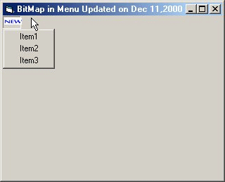



## Bitmap in Menu / SubMenu \(Not Menu Icon\)

### Description

UPDATED !!! This code puts a bitmap image file in your SubMenu or Menu or BOTH. Please note that this is very different from using icons in your menus. Please vote for this code if you like it or if it is any use to you.
 
### More Info
 

             |
---                |---
**Submitted On**   |2000-12-11 08:58:04
**By**             |[Syntax](https://github.com/Planet-Source-Code/PSCIndex/blob/master/ByAuthor/syntax.md)
**Level**          |Advanced
**User Rating**    |4.8 (43 globes from 9 users)
**Compatibility**  |VB 5\.0, VB 6\.0
**Category**       |[Custom Controls/ Forms/  Menus](https://github.com/Planet-Source-Code/PSCIndex/blob/master/ByCategory/custom-controls-forms-menus__1-4.md)
**World**          |[Visual Basic](https://github.com/Planet-Source-Code/PSCIndex/blob/master/ByWorld/visual-basic.md)
**Archive File**   |[CODE\_UPLOAD1256812112000\.zip](https://github.com/Planet-Source-Code/syntax-bitmap-in-menu-submenu-not-menu-icon__1-13429/archive/master.zip)

### API Declarations

Just a few... All in the zip.

